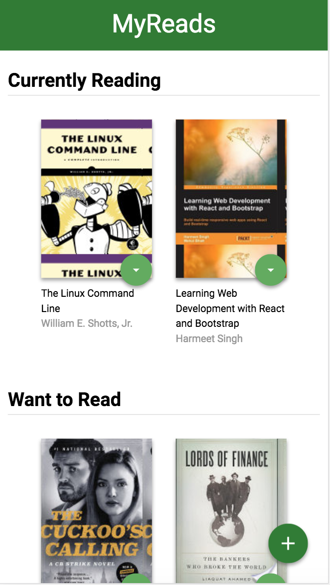

# MyReads Project

This is my implementation for a [starter project](https://github.com/udacity/reactnd-project-myreads-starter) in Udacity's Front-end course. This project, written with React framework as UI management, is a web application that allows a user to search and organize their books. In the main page, there are three shelves: Currently Reading, Want To Read, and Read. Users can move books between these shelves. The app also provides a search page that allows users to add a new book to any of these shelves.

## Install and launch instruction

* install all project dependencies: run `npm install`
* start the development server: run `npm start`
